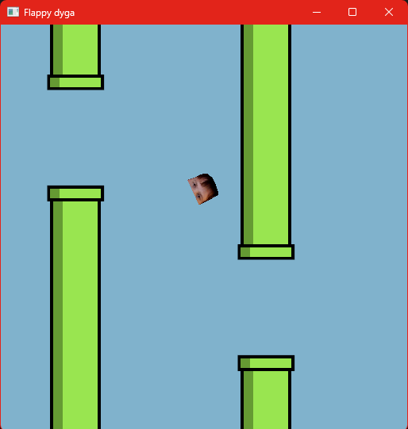

# Flappy Bird Clone in Rust & Bevy

  

## Overview

This is a Flappy Bird based game written in **Rust** using the **Bevy engine**. Created for practise purpose. Instead of bird I use my friend face.

## Features

* Classic Flappy Bird mechanics
* Simple physics: gravity, flapping, and collision detection
* Score tracking
* Cross-platform support (if you manage to compile it… good luck)

## Installation

### Prerequisites

* [Rust](https://www.rust-lang.org/tools/install) (because we love compiler errors!)
* [Bevy](https://bevyengine.org/) (the “easy” game engine that sometimes makes you want to cry)
* Cargo (comes with Rust)

### Steps

```bash
git clone https://github.com/yourusername/flappy-bird-rust.git
cd flappy-bird-rust
cargo run
```

## Controls

* **Spacebar** – flap

## Why Rust & Bevy?

Because nothing screams “fun” like wrestling with lifetimes and borrowing while trying to make a 2D bird fly.

Bevy is awesome once you figure out how to use it… which might take a couple of existential crises.

## Contributing

Pull requests are welcome. If you want to contribute, be ready to explain why your solution works in Rust’s ownership model, or risk being publicly shamed.

## License

MIT License. Do whatever you want, just don’t blame me if Bevy eats your CPU.
